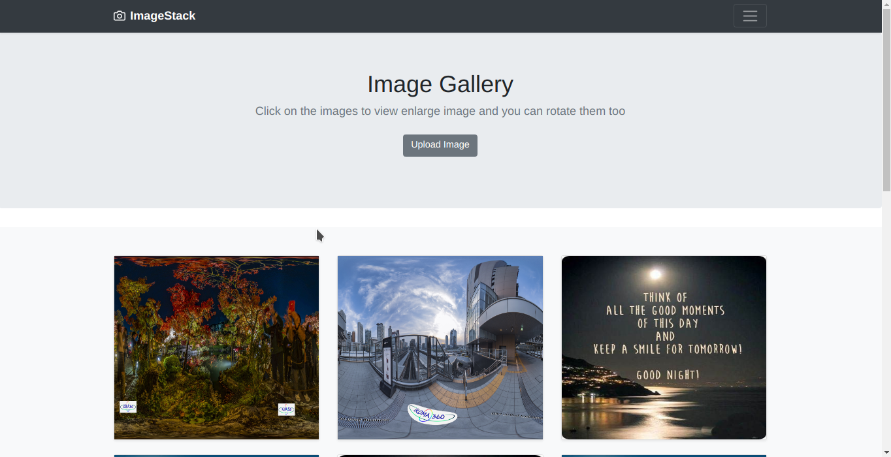

# DJANGO-PHOTO-GALLERY

It's a photo gallery web app made for practicing django-framework.

## Features

- Allow to uplaod one image at a time to gallery
- List all the images at home page.
- Tag can be added to images.

## Todo

- Multiple image input to upload them.
- Rotate the image clockwise or anticlock wise on clicking image rotation buttons in detail screen.
- Filter the images on home page on basis of tag.  

## Technology Stack

- HTML5/CSS3, Bootstrap, JavaScriptES6, Django framework.

## REQUIREMENTS

* python3+(3.8.6)
* pip
* pipenv

## Running the app

* If the above tools are installed correctly then run below commands to start local server:
    * `$git clone https://github.com/coderoo7/django-photo-gallery`
    * `$cd django-photo-gallery` 
    * `$pipenv shell` 
    * `$pip install requirements.txt`
    * `$cd photo_gallery`
    * `$python manage.py runserver` 

* Point browser to [localhost:8000](http://localhost:8000)

## Contribution

1. Clone/fork repository and create a new branch: $ git checkout `https://github.com/CoderOO7/django-photo-gallery.git -b your-branch-name`
2. Make your changes
3. Submit a pull request and explain your changes.
